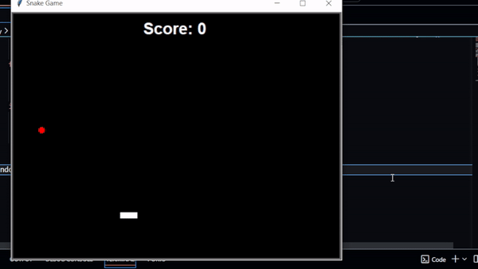

# Snake Game

This is a classic Snake game implemented in Python using the Turtle module. The game showcases various concepts of Object-Oriented Programming (OOP).

## Features

- **Speed Increase**: The game starts with a normal speed, which increases each time you pass a stage (stage = 6 in score).
- **Score Display**: The current score is shown on the screen, providing feedback as you play.
- **OOP Principles**: Utilizes classes, objects, and inheritance to keep the code organized. Each class is responsible for specific functionalities.

## Requirements

- Python (Windows users should install Python from the official website https://www.python.org/)
- Turtle module (install using pip)

## Installation && Usage

1. Clone the repository:

   ```bash
   git clone https://github.com/Mohamed-ait-alla/Python-Snake-Game.git
2. Install the required module:

    ```bash
    pip install turtle
3. Navigate to the directory:

    ```bash
    cd Python-Snake-Game
4. Run the main file:

    ```bash
    python main.py

## Example Interaction
<p style="align: center;">
    
</p>

##  
<p style="font-weight: bold;">Feel free to play the game, and if you feel inspired, modify it to make it even better! Your creativity can help enhance the experience for everyone.</p>
